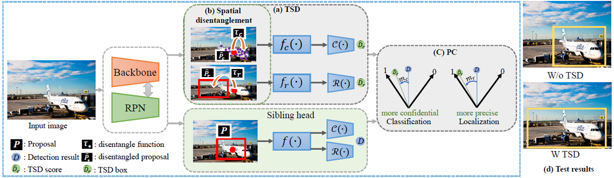

# TSD

**News**:

**2021.1.26: We add supports for openimages dataset and also release the pretrained models.**

2020.6.9: We add supports for Mask RCNN and Cascade RCNN. The pretrained models are also released via GoogleDrive.

2020.5.8: We add supports for fp16 training with TSD and update the performance on X101_64x4d backbone.

2020.4.29: We reimplement the TSD algorithm based on the MMDetection [framework](https://github.com/open-mmlab/mmdetection).

Paper:

  Revisiting the Sibling Head in Object Detector (CVPR 2020) (https://arxiv.org/abs/2003.07540)

  1st place solutions for openimage 2019 (https://arxiv.org/abs/2003.07557)

## Introduction

The installation of MMDetection can be found from the official github(https://github.com/open-mmlab/mmdetection)

TSD is a plugin detector head which is friendly to any anchor-based two stage detectors (Faster RCNN, Mask RCNN and so on).



## Changelog

**V1.0**:
We firstly reimplement the experiments based on Faster RCNN with Resnet families.

The SharedFCBBoxHead is used as the sibling head.

The corresponding configuration can be found in (faster_rcnn_r50_fpn_TSD_1x.py, faster_rcnn_r101_fpn_TSD_1x.py, faster_rcnn_r152_fpn_TSD_1x.py)

### Tips:

1. LR can be set to base_lr\*total_batch (base_lr=0.00125, 0.04 = 0.00125\*32 in our experiments.)
2. An external epoch can be used to perform warmup. (base_lr will be incresed to LR in the first epoch)

## Preparing Data

We add supports for both coco dataset and openimages dataset. Datasets should be organized as following.

Files in `./TSD/data/OpenImages/challenge2019` can be downloaded from [here](https://drive.google.com/file/d/1-CnE3akagnoyDarrDuKTl7OF9vwF_rA3/view?usp=sharing) or [Dropbox](https://www.dropbox.com/s/41bs8o101v5v4m0/challenge2019.zip?dl=0).

```bash
TSD/data
├── coco
│   ├── annotations
│   ├── train2017
│   └── val2017
└── OpenImages
    ├── challenge2019
    │   ├── challenge-2019-train-detection-bbox.txt
    │   ├── challenge-2019-validation-detection-bbox.txt
    │   ├── class_label_tree.np
    │   └── class_sample_train.pkl
    └── OpenImages
        ├── test
        ├── train
        └── validation
```

## Experiments on COCO Dataset

Reimplemented methods and backbones are shown in the below table. It's based on the Faster RCNN with FPN.
More backbones and experiments are underway.
(If you want to obtain the pretrained models via other manners, please send me e-mail).

### For standard Faster RCNN

| Backbone           | TSD   | AP             | AP_0.5  | AP_0.75  | AP_s    | AP_m      | AP_l     | Download |
|:--------------------:|:-----:|:--------------:|:-------:|:--------:|:-------:|:---------:|:--------:|:--------:|
| ResNet50           |       | 36.2           | 58.1    | 39.0     | 21.8    | 39.9      |46.1      |  |
| ResNet50           | ✓     | **40.9**      | **61.9** | **44.4** |**24.2**  |**44.4**  |**54.0**   |[model](https://drive.google.com/file/d/1G0ngN4Ro5PpcB7S__09Cz3EkAfsWWPy_/view?usp=sharing) |
| ResNet101          |       | 38.9           | 60.6    | 42.4     | 22.3    | 43.6      |50.6      |  |
| ResNet101          | ✓     | **42.3**      | **63.1**| **45.9**  | **25.1**|**46.3**  |**56.5**    |[model](https://drive.google.com/open?id=1FghatPmrWx8QPeZaOn-dODJP3nqu9Jdj) |
| ResNet152          |       |  40.5        |62.1      |44.5     | 24.6     |45.0       | 51.8      | |
| ResNet152          | ✓     | **43.7**     |**64.5**  |**47.6** |**26.1**  |**48.0**   |**57.5**   |[model](https://drive.google.com/open?id=1OQTkZIzNZ323BBxsxwMbl6YDYAgAfvb0)|

### For Mask RCNN

| Backbone           | TSD   | AP             | AP_0.5  | AP_0.75  | AP_s    | AP_m      | AP_l     | MaskAP | Download |
|:------------------:|:-----:|:--------------:|:-------:|:--------:|:-------:|:---------:|:--------:|:--------:|:--------:|
| ResNet50           | ✓     | 41.2           | 61.9    | 44.7     | 24.3    | 44.8      | 54.8      |  35.8   |  [model](https://drive.google.com/file/d/17iFSOinWyTtWRF4wc6B-zNext4DuZLDt/view?usp=sharing)    |

### For Cascade RCNN

| Backbone           | TSD   | AP             | AP_0.5  | AP_0.75  | AP_s    | AP_m      | AP_l     | Download |
|:------------------:|:-----:|:--------------:|:-------:|:--------:|:-------:|:---------:|:--------:|:--------:|
| ResNet50           |       | -             | -        |  -       | -       | -         | -        |          |
| ResNet50           | ✓     | **42.0**      | **59.9** | **45.4** |**24.3**  |**45.5**  |**57.1**   |[model](https://drive.google.com/file/d/1bJulo-_NAhBOLTDvEuIlSsDSwh6sQghX/view?usp=sharing) |
| ResNet101          |       | 41.8          | 60.0     |  45.5    | 24.4    |45.8       |55.1       |          |
| ResNet101          | ✓     | **42.9**      | **60.8** | **46.4** |**24.8**  |**46.5**  |**57.7**   |[model](https://drive.google.com/file/d/1RVomu6temvNNg0DIE85Pg-CcUf3GIg8n/view?usp=sharing) |
| ResNet101_mstest   | ✓     | **45.0**      | **63.6** | **49.2** |**28.7**  |**49.1**  |**57.8**   |        |

### TBD

**We will continue to update the pretrained models of some heavy backbones.**
We train the ResNext101-64x4d model with DCN and multi-scale training. Evaluation is performed on COCO minival with multi-scale test.
| Backbone           | TSD   |AP             | AP_0.5  | AP_0.75  | AP_s    | AP_m      | AP_l     | Download |
|:------------------:|:-----:|:-------------:|:-------:|:--------:|:--------:|:---------:|:--------:|:--------:|
| X-101-64x4d-FPN      | ✓   | 49.2           | 70.1    | 53.8     | 33.2    | 53.1      |63.7      | [model](https://drive.google.com/open?id=1tMf_7Aix2Tx0itVZtnPF-FbqfX2RM4zL) |
## Experiments on OpenImages Dataset

For standard Faster RCNN
| Backbone           | TSD   | AP              | Download |
|:--------------------:|:-----:|:--------------:|:-------:|
| ResNet50           |       | 70.7     | [model](https://drive.google.com/file/d/1Nf7wNTKesjlZD1sanNmGJTPAVYzEiOGg/view?usp=sharing)|
| ResNet50           | ✓     | **72.2**  | [model](https://drive.google.com/file/d/1yssanW8ny-nXDUijXaYXWrV6FxVSvZ9K/view?usp=sharing) |


## Installation

Please refer to [MMdetection](docs/INSTALL.md) for installation and dataset preparation.


## Get Started
```shell
./tools/slurm_train.sh dev TSD configs/faster_rcnn_r152_fpn_TSD_1x.py exp/TSD_r152/ 16
```


## Citations

If the TSD helps your research, please cite the follow papers.

```
@article{song2020revisiting,
  title={Revisiting the Sibling Head in Object Detector},
  author={Song, Guanglu and Liu, Yu and Wang, Xiaogang},
  journal={CVPR},
  year={2020}
}
@article{liu20201st,
  title={1st Place Solutions for OpenImage2019--Object Detection and Instance Segmentation},
  author={Liu, Yu and Song, Guanglu and Zang, Yuhang and Gao, Yan and Xie, Enze and Yan, Junjie and Loy, Chen Change and Wang, Xiaogang},
  journal={arXiv preprint arXiv:2003.07557},
  year={2020}
}
```


## Contact

If you have any questions, please contact (songguanglu@sensetime.com).
